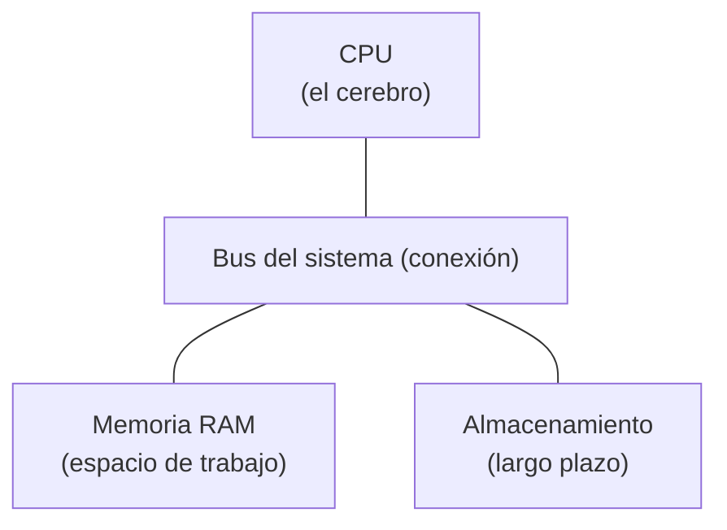
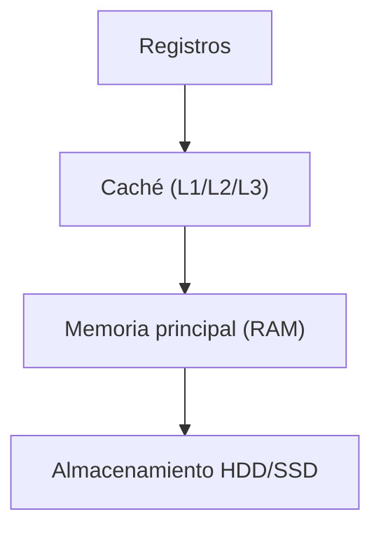

# Fundamentos de la Computación

## Metadata
- **Fuente original:** `raw/papers/2026-08-03-fundamentos-computacion.md`
- **Autor:** [[big-school]]
- **Fecha:** 2026-08-03
- **Tipo de documento:** Documento Técnico (PDF `0_5_1_-_Fundamentos_de_la_computación.pdf`, Módulo 0)

## Summary
Primera fuente de un nuevo bloque temático del wiki ("Módulo 4: Fundamentos de Sistemas, Redes y Datos") que desciende desde el software hacia el hardware: transistores y sistema binario, arquitectura Von Neumann (CPU, RAM, almacenamiento), la jerarquía de memoria (registros → caché L1/L2/L3 → RAM → disco), el rol del sistema operativo como árbitro de recursos (kernel space vs. user space), procesos e hilos, la distinción crítica entre concurrencia y paralelismo, condiciones de carrera, y memoria virtual/swapping. El hilo argumental es estratégico: la IA genera código masivamente, pero solo el conocimiento humano de estos fundamentos permite auditar que ese código sea eficiente y sostenible en hardware real.

## Key Takeaways
1. **Todo se reduce a transistores en dos estados** (encendido/apagado → 1/0); 8 bits forman un byte, la unidad de codificación de toda la realidad digital.
2. **Arquitectura Von Neumann:** unifica datos e instrucciones en la misma memoria (RAM), permitiendo que el ordenador sea reprogramable. La CPU ejecuta el ciclo **fetch-decode-execute**.
3. **Jerarquía de memoria:** a menor distancia física de la CPU, menor latencia — registros y caché (L1/L2/L3) son casi instantáneos; RAM es rápida pero volátil; el disco es órdenes de magnitud más lento.
4. **El sistema operativo arbitra recursos** entre Kernel Space (acceso total al hardware) y User Space (privilegios restringidos), gestionando qué proceso usa la CPU mediante Time-Slicing (Scheduling).
5. **Concurrencia ≠ Paralelismo:** concurrencia es alternar rápidamente entre tareas (un solo núcleo, sensación de simultaneidad); paralelismo requiere múltiples núcleos físicos operando exactamente al mismo tiempo.
6. **Los hilos comparten memoria** y son eficientes, pero introducen **condiciones de carrera** (race conditions) cuando dos hilos modifican el mismo dato simultáneamente — un riesgo que la IA generativa suele no prever.
7. **Memoria virtual y swapping:** cuando la RAM no basta, el SO mueve datos no usados al disco (Swap) — mucho más lento, degradando críticamente el rendimiento si se depende de ello.

## Detailed Breakdown

### 1. Del Bit a la Puerta Lógica: La Realidad Binaria
Un transistor tiene dos estados (pasa/no pasa corriente), representados como 1 y 0 — el único lenguaje nativo del hardware. El **bit** es la unidad mínima de información; 8 bits forman un **byte**. Combinando miles de millones de transistores se forman puertas lógicas (AND, NOT, OR) que permiten comparación y aritmética básica — la base física de por qué ciertas operaciones son más costosas que otras en ciclos de reloj.

### 2. Arquitectura Von Neumann: El Plano Maestro
Unifica datos e instrucciones en la misma memoria (RAM), lo que hace al ordenador reprogramable. Tres pilares:
- **CPU:** ejecuta el ciclo **Fetch** (obtiene la instrucción de la RAM) → **Decode** (la interpreta) → **Execute** (la realiza).
- **Memoria RAM:** espacio de trabajo volátil y rápido para procesos activos.
- **Almacenamiento Persistente:** biblioteca de largo plazo, masiva pero con latencias mucho mayores.

### 3. La Jerarquía de Memoria y el Rendimiento
La regla de oro: los datos deben estar lo más cerca posible de la CPU. Niveles de caché (L1/L2/L3) integrados en el procesador mitigan la lentitud relativa de la RAM. Acceder a caché es casi instantáneo (nanosegundos); acceder a disco puede ser órdenes de magnitud más lento (milisegundos). Un software mal optimizado por IA puede ignorar esta jerarquía y disparar tiempos de ejecución.

### 4. Gestión del Sistema Operativo y Concurrencia
El SO abstrae el hardware y gestiona recursos como árbitro (qué programa usa la CPU, cuánta memoria, cuándo accede a disco). Opera en dos dominios: **Kernel Space** (el núcleo, acceso total pero sensible) y **User Space** (aplicaciones, privilegios restringidos).

### 5. Procesos, Hilos y el Desafío de la Multitarea
Un **Proceso** es una instancia en ejecución con su propia memoria aislada. El **Planificador** (Scheduler) alterna la atención de la CPU entre procesos miles de veces por segundo (**Time-Slicing**), creando la ilusión de simultaneidad. Distinción crítica:
- **Concurrencia:** alternar rápidamente entre tareas (scheduling) — sensación de simultaneidad.
- **Paralelismo:** múltiples núcleos físicos operando exactamente al mismo tiempo.

Los **hilos (threads)** comparten memoria dentro de un proceso — eficientes, pero con riesgo de **condiciones de carrera** (race conditions) cuando dos hilos modifican el mismo dato simultáneamente, provocando errores catastróficos. La IA redacta bien funciones aisladas pero suele fallar en prever estos conflictos de concurrencia.

### 6. Memoria Virtual y el Impacto del Swapping
Cuando se abren más programas de los que caben en RAM física, el SO usa **Memoria Virtual** vía **swapping/paginación**: combina RAM con espacio de disco (Swap), moviendo datos no usados temporalmente al disco. Dado que el disco es drásticamente más lento, depender del swap degrada el rendimiento críticamente — especialmente grave en entornos de IA que manejan grandes volúmenes de datos en memoria.

### 7. Observaciones Clave
- Las abstracciones tienen fugas: el código corre sobre hardware físico con límites reales, no importa cuánto lo oculte la nube.
- Priorizar siempre caché/RAM frente a almacenamiento persistente para reducir latencia.
- Supervisar siempre el acceso a memoria compartida cuando la IA sugiere threads, para evitar condiciones de carrera.
- Un código que consume RAM en exceso activa el swapping, penalizando el rendimiento en producción.

### 8. Conclusión Estratégica
Dominar estos fundamentos permite pasar de consumidor de tecnología a arquitecto de soluciones robustas, con el criterio necesario para auditar código generado por IA. La IA aporta velocidad de implementación; el conocimiento humano del hardware garantiza eficiencia, escalabilidad y viabilidad económica.

## Diagrams & Visualizations

### Arquitectura Von Neumann

### Jerarquía de Memoria

## Entities Mentioned
- [[big-school]]

## Concepts Discussed
- [[fundamentos-de-computacion]]
- [[programacion-asincrona]]

## Notable Quotes
> "Las abstracciones tienen fugas: no permitas que la comodidad de la nube nuble el entendimiento de que el código corre sobre hardware físico con límites reales."

## Connections & Reflections
- Es la primera fuente del nuevo **Módulo 4: Fundamentos de Sistemas, Redes y Datos** — no existía ningún concepto previo en el wiki sobre hardware, sistema operativo o concurrencia real (procesos/hilos), por lo que se crea el concepto nuevo [[fundamentos-de-computacion]].
- La distinción **concurrencia vs. paralelismo** conecta directamente con [[programacion-asincrona]] (Módulo 3): la asincronía de `asyncio` es concurrencia en un solo hilo (cede el control durante la espera de I/O), no paralelismo real — una precisión que [[programacion-asincrona]] no había hecho explícita hasta ahora.
- Sin contradicciones con conocimiento previo del wiki.

## Open Questions
- ¿Cómo se combina `asyncio` (concurrencia cooperativa en un solo hilo) con `multiprocessing` (paralelismo real multi-núcleo) en aplicaciones con cargas mixtas I/O-bound y CPU-bound? (Pregunta ya abierta en [[programacion-asincrona]], ahora con marco conceptual más preciso gracias a esta fuente.)

## Related Sources
- [[wiki/sources/2026-07-30-asincronia-en-python]] — asyncio como forma de concurrencia I/O-bound en un solo hilo.
- [[wiki/sources/2026-08-03-redes]] — la capa de red que consume estos mismos recursos de CPU/memoria en cada petición.

---

**Estado:** ✅ Completamente procesado e integrado en el wiki
