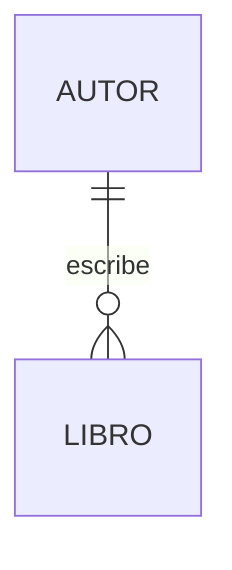

# Gestión de Datos

## Metadata
- **Fuente original:** `raw/papers/2026-08-03-gestion-datos.md`
- **Autor:** [[big-school]]
- **Fecha:** 2026-08-03
- **Tipo de documento:** Documento Técnico (PDF `0_5_4_-_Gestión_de_datos.pdf`, Módulo 0)

## Summary
Cuarta fuente del Módulo 4: recorre el modelado de datos (modelo Entidad-Relación, cardinalidad 1:1/1:N/N:M), su traducción al modelo relacional (tablas, claves primarias/foráneas, normalización), el lenguaje SQL para operaciones CRUD y `JOIN`/agregación, y cierra con la diversificación NoSQL (documental, clave-valor, columnar, grafos) y las propiedades **ACID** que diferencian a los sistemas relacionales. Incluye ejemplos SQL ejecutables completos, desde `INSERT` básico hasta `LEFT JOIN` con `GROUP BY`.

## Key Takeaways
1. **El modelado de datos precede a la implementación:** el Modelo Entidad-Relación (ER) define Entidades (sustantivos), Atributos (características) y Relaciones (verbos) antes de tocar código.
2. **Cardinalidad define el comportamiento numérico entre entidades:** Uno a Uno (1:1), Uno a Muchos (1:N), Muchos a Muchos (N:M — requiere tabla de unión/join table).
3. **Modelo relacional:** Entidad → Tabla, Atributo → Columna, Instancia → Fila. **Clave Primaria (PK)** identifica cada registro únicamente; **Clave Foránea (FK)** implementa relaciones referenciando la PK de otra tabla.
4. **Normalización** organiza las tablas para minimizar redundancia y maximizar integridad.
5. **SQL es declarativo** (CRUD: `INSERT`/`SELECT`/`UPDATE`/`DELETE`) — se especifica *qué* se quiere, no *cómo* obtenerlo. `JOIN` consolida datos de múltiples tablas; funciones de agregación (`COUNT`, `AVG`, `SUM`, `MIN`, `MAX`) permiten cálculos estadísticos.
6. **ACID (Atomicidad, Consistencia, Aislamiento, Durabilidad)** es lo que garantiza que una transacción (ej. una transferencia bancaria) se complete íntegramente o no se realice en absoluto.
7. **SQL vs. NoSQL no es preferencia, es decisión de arquitectura:** SQL prioriza consistencia transaccional con esquema estricto; NoSQL (documental, clave-valor, columnar, grafos) sacrifica algo de consistencia por escalabilidad horizontal y manejo de datos no estructurados.

## Detailed Breakdown

### 1. Fundamentos del Diseño y Modelado de Datos
A medida que una aplicación crece, aparecen problemas de redundancia, inconsistencia, concurrencia y rendimiento — la razón de ser de un DBMS. Antes de implementar, el **Modelo Entidad-Relación (ER)** define tres componentes: **Entidades** (sustantivos: libros, usuarios), **Atributos** (características: ISBN, nombre) y **Relaciones** (verbos: "escribe", "pertenece a"). La **cardinalidad** (1:1, 1:N, N:M) determina el comportamiento numérico entre entidades — las relaciones N:M requieren una tabla de unión para evitar duplicidades.

### 2. El Modelo Relacional
Las Entidades se convierten en Tablas, los Atributos en Columnas, cada instancia en una Fila. La **Clave Primaria (PK)** garantiza identificación única de cada registro; la **Clave Foránea (FK)** es una columna en la tabla "hija" que referencia la PK de la tabla "padre", implementando la relación. Para relaciones N:M se usa una **Tabla de Unión** (ej. `Inscripciones` entre `Estudiantes` y `Cursos`). La **Normalización** es el proceso de organizar tablas para minimizar redundancia y maximizar integridad.

### 3. El Paradigma SQL frente a la Flexibilidad NoSQL
**SQL** (Structured Query Language) es el estándar predominante sobre esquemas estrictos y relaciones fuertes (PostgreSQL, MySQL, Oracle), garantizando las propiedades **ACID** (Atomicidad, Consistencia, Aislamiento, Durabilidad) — críticas para que una transacción se complete íntegramente o no ocurra en absoluto. **NoSQL** (Not Only SQL) surge para escalabilidad horizontal masiva y datos no estructurados, sacrificando algo de consistencia por velocidad/disponibilidad: Documentales (MongoDB), Clave-Valor (Redis), Columnares (Cassandra), Grafos (Neo4j).

### 4. Interacción y Manipulación mediante Lenguaje Declarativo
SQL es declarativo: se especifica *qué* se quiere, no *cómo* obtenerlo. **CRUD** en SQL: `INSERT` (Create), `SELECT` (Read, con `WHERE`/`ORDER BY`), `UPDATE` (Update, siempre con `WHERE` para no afectar toda la tabla), `DELETE` (Delete, igualmente crítico usar `WHERE`). La cláusula **JOIN** (ej. `INNER JOIN`, `LEFT JOIN`) consolida datos de múltiples tablas relacionadas. Las funciones de agregación (`COUNT`, `AVG`, `SUM`, `MIN`, `MAX`), combinadas con `GROUP BY`, permiten cálculos estadísticos en tiempo real.

### 5. Observaciones Clave
- La normalización minimiza redundancia y maximiza integridad en sistemas relacionales.
- PK garantiza unicidad; FK mantiene el vínculo lógico entre tablas.
- Omitir `WHERE` en `UPDATE`/`DELETE` puede causar pérdida o alteración accidental de toda la tabla.
- ACID diferencia a las bases relacionales en seguridad transaccional.
- La elección SQL vs. NoSQL depende de la estructura del dato y los requisitos de escala, no de preferencia tecnológica.

### 6. Conclusión Estratégica
El modelado correcto de datos sigue siendo responsabilidad humana insustituible: la IA puede asistir en escribir consultas, pero solo la comprensión profunda de la arquitectura de datos permite validar que sean seguras y eficientes. Un diseño defectuoso de base de datos es una deficiencia estructural que ninguna IA corrige por sí sola.

## Diagrams & Visualizations



## Code & Pseudocode Examples

### CRUD básico en SQL
```sql
-- CREATE
INSERT INTO Autores (Nombre, Nacionalidad)
VALUES ('Isabel Allende', 'Chilena');

-- READ
SELECT * FROM Autores;
SELECT Nombre, Nacionalidad FROM Autores
WHERE Nacionalidad = 'Británica';
SELECT * FROM Autores
ORDER BY Nombre ASC;

-- UPDATE
UPDATE Autores
SET Nacionalidad = 'Colombiana (Actualizado)'
WHERE AutorID = 1;

-- DELETE
DELETE FROM Libros
WHERE LibroID = 103;

-- ¡PELIGRO! Sin WHERE, esto borrará TODOS los libros
DELETE FROM Libros;
```

### JOIN entre tablas relacionadas
```sql
SELECT
    L.Titulo,
    A.Nombre AS NombreAutor
FROM
    Libros L
INNER JOIN
    Autores A ON L.AutorID = A.AutorID;
```

### Agregación con GROUP BY
```sql
SELECT
    A.Nombre AS NombreAutor,
    COUNT(L.LibroID) AS TotalLibros
FROM
    Autores A
LEFT JOIN
    Libros L ON A.AutorID = L.AutorID
GROUP BY
    A.Nombre;
```

## Entities Mentioned
- [[big-school]]

## Concepts Discussed
- [[modelado-de-datos-y-bases-de-datos]]

## Notable Quotes
> "Un diseño defectuoso en la base de datos es una deficiencia estructural que ninguna IA puede corregir por sí sola."

## Connections & Reflections
- Cuarta fuente del Módulo 4 — no existía ningún concepto de bases de datos en el wiki (el Módulo 2 cubrió estructuras de datos en memoria, pero no persistencia estructurada). Se crea [[modelado-de-datos-y-bases-de-datos]] como concepto nuevo.
- Conecta con [[estructuras-de-datos]] (Módulo 2): una tabla SQL es, en esencia, una colección de "diccionarios" (filas) con esquema fijo — el mismo concepto de clave-valor visto en Python, aplicado a persistencia estructurada.
- Las APIs REST de [[apis-rest]] típicamente exponen datos que provienen de una base de datos modelada aquí — cierra el círculo del Módulo 4 (hardware → red → API → datos).

## Open Questions
- ¿Qué nivel de normalización (1FN, 2FN, 3FN) es razonable exigir en un proyecto real antes de que el coste de los JOINs adicionales supere el beneficio de la integridad?

## Related Sources
- [[wiki/sources/2026-08-03-apis-comunicacion]] — las APIs REST como capa de exposición de los datos modelados aquí.
- [[wiki/sources/2026-07-30-estructuras-de-datos]] — estructuras de datos en memoria (Módulo 2), complementarias a la persistencia estructurada en disco.

---

**Estado:** ✅ Completamente procesado e integrado en el wiki
