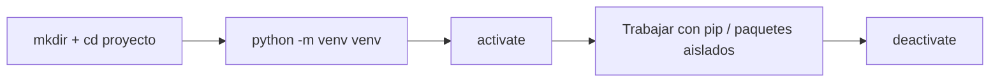

# Gestión de Entornos y Dependencias (Segunda Pasada)

## Metadata
- **Fuente original:** `raw/papers/2026-08-03-gestion-entornos-dependencias.md`
- **Autor:** [[big-school]]
- **Fecha:** 2026
- **Tipo de documento:** Documento Técnico / Material de Curso (Módulo 0: Fundamentos del Desarrollo de Software — Máster Desarrollo con IA)

## Summary
Versión concisa y muy práctica de `venv`/`pip`/`requirements.txt`, con un diagrama de flujo del ciclo de vida completo del entorno virtual (crear → activar → trabajar → desactivar) y un ejemplo real de `requirements.txt` generado con `pip freeze`, mostrando el version pinning exacto (`requests==2.32.5`) en un caso concreto.

## Key Takeaways
1. Un entorno virtual es una **copia autocontenida** de una instalación de Python: intérprete propio + espacio de paquetes vacío e independiente.
2. **`venv`** es el módulo estándar de Python para crear estos entornos (`python -m venv venv`).
3. El ciclo completo es: crear carpeta de proyecto → `python -m venv venv` → activar (`source venv/bin/activate` en macOS/Linux, `venv\Scripts\activate` en Windows) → trabajar con `pip` → `deactivate`.
4. **`pip`** instala, actualiza y elimina paquetes dentro del entorno virtual activo (`pip install`, `pip list`).
5. **`requirements.txt`** se genera con `pip freeze > requirements.txt` y se reproduce en otra máquina con `pip install -r requirements.txt` — el ejemplo real muestra versiones exactas fijadas (`certifi==2025.8.3`, `requests==2.32.5`, etc.).

## Detailed Breakdown

### 1. Entorno Virtual — Qué es y Cómo se Crea
Un entorno virtual es una copia autocontenida de una instalación de Python: copia del intérprete + espacio propio para instalar librerías (paquetes), inicialmente vacío. `venv` es la herramienta estándar de la librería nativa para crearlos.

### 2. Ciclo de Vida Completo
Crear la carpeta del proyecto → `python -m venv venv` → activar según sistema operativo → trabajar con `pip`/paquetes aislados → `deactivate` al terminar. El diagrama de flujo de la fuente resume este ciclo en cinco pasos secuenciales.

### 3. Gestión de Paquetes con PIP
Un paquete es código de terceros que resuelve un problema específico (peticiones web, análisis de datos, gráficos). `pip` instala (`pip install requests`), lista (`pip list`), actualiza y elimina paquetes dentro del entorno activo.

### 4. Archivo de Requisitos
`requirements.txt` contiene todas las dependencias del proyecto. `pip freeze > requirements.txt` congela la lista de paquetes instalados con sus versiones exactas; `pip install -r requirements.txt` la reproduce en cualquier otra máquina — la pieza clave de reproducibilidad entre entornos.

## Diagrams & Visualizations



## Code & Pseudocode Examples

### Ciclo completo del entorno virtual
```bash
mkdir mi_proyecto_genial
cd mi_proyecto_genial

python -m venv venv

venv\Scripts\activate       # Windows
source venv/bin/activate    # macOS/Linux

deactivate
```

### Gestión de paquetes y requirements.txt
```bash
pip install requests
pip list

pip freeze > requirements.txt
pip install -r requirements.txt
```

### Ejemplo real de requirements.txt (version pinning)
```text
certifi==2025.8.3
charset-normalizer==3.4.3
idna==3.10
requests==2.32.5
urllib3==2.5.0
```

## Entities Mentioned
- [[big-school]]

## Concepts Discussed
- [[entornos-virtuales-y-dependencias]]

## Notable Quotes
> "Un entorno virtual es una copia autocontenida de una instalación de Python."

## Connections & Reflections
- Reafirma [[wiki/sources/2026-07-30-gestion-de-entornos-y-dependencias]], ya integrado en [[entornos-virtuales-y-dependencias]] — sin contradicción. Aporta el diagrama de flujo del ciclo de vida y un ejemplo real y concreto de `requirements.txt` con version pinning que sirve como referencia práctica directa.

## Open Questions
- (Ninguna nueva — la fuente reafirma el conocimiento ya consolidado en [[entornos-virtuales-y-dependencias]], incluida su pregunta abierta sobre gestores más modernos como Poetry/uv/pipenv.)

## Related Sources
- [[wiki/sources/2026-07-30-gestion-de-entornos-y-dependencias]] — primera pasada sobre `venv`, `pip` y `requirements.txt`.
- [[wiki/sources/2026-08-03-modularidad-python-modulos-paquetes]] — infraestructura de proyecto (paquetes de código) complementaria a la infraestructura de dependencias (paquetes de terceros).

---

**Estado:** ✅ Completamente procesado e integrado en el wiki
