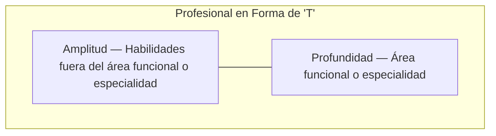

# Introducción a los Lenguajes de Programación (Python — Perfil en T)

## Metadata
- **Fuente original:** `raw/papers/2026-08-03-introduccion-lenguajes-programacion-python.md`
- **Autor:** [[big-school]]
- **Fecha:** 2026
- **Tipo de documento:** Documento Técnico / Material de Curso (Módulo 0: Fundamentos del Desarrollo de Software — Máster Desarrollo con IA)

## Summary
Segunda pasada sobre la introducción a los lenguajes de programación, con un enfoque estratégico-profesional en vez de taxonómico. Presenta al desarrollador como un **"perfil en T"** (amplitud de conocimientos generales + profundidad en un lenguaje troncal) y justifica la elección de **Python** como lenguaje de referencia por tres pilares: legibilidad, versatilidad multidisciplinar y predominio en IA/Ciencia de Datos. Cierra con la distinción compilado/interpretado ya vista en el Módulo 3, reforzada con un ejemplo de "Hola, Mundo!" y observaciones sobre convenciones profesionales (`snake_case`, inglés como idioma estándar de codificación, versión mínima de Python).

## Key Takeaways
1. **Perfil en T:** la barra horizontal (amplitud/versatilidad) permite migrar entre tecnologías sin fricción; la barra vertical (profundidad en un lenguaje troncal) da la maestría necesaria para ejecutar soluciones complejas.
2. **Python se elige por tres pilares:** legibilidad/eficiencia, versatilidad multidisciplinar ("navaja suiza") y predominio en el ecosistema de IA/Data Science.
3. **Python es un lenguaje interpretado:** un intérprete traduce y ejecuta línea por línea, priorizando flexibilidad y retroalimentación inmediata sobre velocidad bruta de ejecución.
4. **Convenciones profesionales no negociables:** `snake_case` para variables y el inglés como idioma estándar de codificación (`user_name`, no `nombre_usuario`) para garantizar mantenibilidad en equipos globales.
5. **Requisito operativo:** verificar Python ≥ 3.10 para compatibilidad con librerías modernas de IA; supervisar activamente el código generado por asistentes de IA (Copilot) durante el aprendizaje.

## Detailed Breakdown

### 1. La Filosofía del Desarrollador Polivalente (Perfil en T)
La especialización extrema es un riesgo de obsolescencia en el contexto actual. El **perfil en T** resuelve esa tensión: la barra horizontal representa la versatilidad (diálogo entre tecnologías, comprensión del ecosistema, colaboración multidisciplinar); la barra vertical representa la profundidad (maestría en un "instrumento" principal). Aprender un lenguaje específico es, en el fondo, un entrenamiento para el aprendizaje continuo de cualquier tecnología futura — el valor reside en la arquitectura del pensamiento, no en la herramienta.

### 2. Python como Estándar Estratégico en la Era de la IA
Tres pilares justifican la elección ejecutiva de Python:
- **Legibilidad y Eficiencia:** sintaxis limpia, cercana al lenguaje humano, que minimiza la fricción técnica.
- **Versatilidad Multidisciplinar:** "navaja suiza" capaz de cubrir desde automatizaciones simples hasta aplicaciones web y análisis masivo de datos.
- **Predominio en IA:** el ecosistema moderno de IA y Ciencia de Datos está construido casi en su totalidad sobre Python.

### 3. La Comunicación entre el Humano y la Máquina
Recapitula la distinción entre **lenguajes compilados** (se traduce la totalidad del código a un ejecutable independiente, muy rápido en ejecución) y **lenguajes interpretados** (un intérprete traduce y ejecuta línea por línea, priorizando flexibilidad y ciclo de retroalimentación inmediato). Python es interpretado — ideal para experimentación rápida y validación constante de ideas en entornos corporativos.

### 4. Aplicación Práctica y Estándares de la Industria
Más allá de la herramienta (VS Code + extensiones), lo que distingue a un profesional es la disciplina de convenciones: `snake_case` para nombrar variables y el inglés como idioma estándar de codificación — incluso si la lógica se piensa en la lengua materna, el código profesional debe ser universal y mantenible en equipos globales. La IA puede asistir en esta traducción terminológica.

### 5. Observaciones Clave
- Un lenguaje interpretado favorece un entorno de pruebas interactivo, reduciendo el tiempo entre hipótesis y resultado.
- Es crítico verificar Python > 3.10 para garantizar compatibilidad con librerías modernas de IA.
- Los asistentes de IA (GitHub Copilot) deben supervisarse activamente durante el aprendizaje inicial, para comprender la lógica antes de automatizarla.
- El desarrollo en inglés no es opcional en entornos competitivos: es el estándar que garantiza interoperabilidad global del código.

### 6. Conclusión
Dominar Python es el primer paso para convertir visión estratégica en activos digitales. El verdadero valor no está en escribir líneas de código, sino en entender cómo esas líneas interactúan con el hardware para generar valor de negocio — una base que se fortalece, en vez de caducar, con la aparición de nuevas herramientas.

## Diagrams & Visualizations

### Diagrama Mermaid: Perfil en T


## Code & Pseudocode Examples

### Ejemplo introductorio: "¡Hola, Mundo!"
```python
print("¡Hola, Mundo!")

# Esto es un comentario para explicar el código
nombre_usuario = "Alex"
mensaje_bienvenida = "Bienvenido al futuro del software, " + nombre_usuario
print(mensaje_bienvenida)
```

## Entities Mentioned
- [[big-school]]

## Concepts Discussed
- [[python-como-lenguaje]]
- [[mentalidad-de-arquitecto]]
- [[compilacion-e-interpretacion]]

## Notable Quotes
> "Quien domina la estructura gramatical del código adquiere la facultad de migrar entre tecnologías sin fricción, asegurando que el verdadero valor resida en la arquitectura del pensamiento y no solo en la herramienta empleada."

> "El aprendizaje de un lenguaje específico es, en realidad, un entrenamiento para el aprendizaje continuo de cualquier tecnología futura que el mercado demande."

## Connections & Reflections
- Es la segunda fuente del wiki titulada "Introducción a los Lenguajes de Programación" — comparada con [[wiki/sources/2026-07-30-introduccion-a-los-lenguajes-de-programacion]] (taxonomía de niveles de abstracción, paradigmas y modelos de ejecución), esta fuente **no es un duplicado**: aporta el ángulo estratégico-profesional (perfil en T, elección de Python, convenciones de idioma) que la primera no cubría. Ambas coexisten sin contradicción, cubriendo dimensiones distintas del mismo tema.
- El **perfil en T** es una nueva faceta de [[mentalidad-de-arquitecto]] — el profesional que combina amplitud y profundidad estratégica en vez de la mera acumulación de sintaxis.
- Reafirma [[compilacion-e-interpretacion]] con la misma clasificación ya vista, sin matices nuevos.

## Open Questions
- ¿Qué métrica objetiva define cuándo un profesional ha alcanzado suficiente "profundidad" en su lenguaje troncal para empezar a invertir en la "amplitud" de la barra horizontal?

## Related Sources
- [[wiki/sources/2026-07-30-introduccion-a-los-lenguajes-de-programacion]] — taxonomía técnica de niveles de abstracción y paradigmas, complementaria a esta fuente estratégica.
- [[wiki/sources/2026-07-30-fundamentos-de-la-programacion-conclusiones]] — origen de [[mentalidad-de-arquitecto]] como marco de referencia.

---

**Estado:** ✅ Completamente procesado e integrado en el wiki
