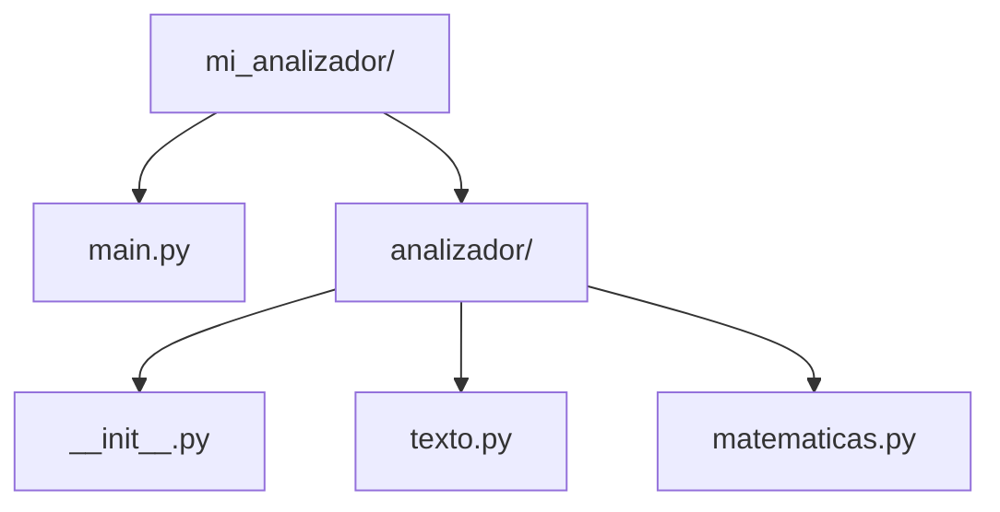

# Modularidad: Módulos y Paquetes en Python (Segunda Pasada)

## Metadata
- **Fuente original:** `raw/papers/2026-08-03-modularidad-python-modulos-paquetes.md`
- **Autor:** [[big-school]]
- **Fecha:** 2026-08-03
- **Tipo de documento:** Documento Técnico / Presentación (PDF `0_4_7_-_Modularidad.pdf`, Módulo 0: Fundamentos del Desarrollo de Software)

## Summary
Presentación práctica de módulos y paquetes en Python con un caso de estudio completo (`text_utils.py` → paquete `analizador/` con `texto.py` y `matematicas.py` → variante `utilidades.py`), recorriendo las cuatro sintaxis de importación con ejemplos ejecutables reales para cada una. Cierra con una lista breve de beneficios (organización, reusabilidad, mantenibilidad, colaboración) idéntica en espíritu a la ya documentada.

## Key Takeaways
1. **Módulo = archivo `.py`; Paquete = carpeta con módulos + `__init__.py`.**
2. **Progresión de refactor real:** de un módulo suelto (`text_utils.py`) a un paquete estructurado (`analizador/` con `texto.py` + `matematicas.py`) a una consolidación en un único módulo de utilidades dentro del paquete (`analizador/utilidades.py`).
3. **Cuatro sintaxis de importación con ejemplo ejecutable cada una:** `import paquete.modulo`, `from paquete import modulo`, `from paquete.modulo import funcion`, `import paquete.modulo as alias`.
4. **Extender un módulo sin romper el contrato existente:** añadir `contar_caracteres(texto, incluir_espacios=True)` a `utilidades.py` no afecta a las funciones ya consumidas por otros archivos.
5. Beneficios resumidos: Organización, Reusabilidad, Mantenibilidad, Colaboración.

## Detailed Breakdown

### 1. Módulos — Definición y Primer Ejemplo
Cualquier archivo `.py` es un módulo; su nombre de archivo es su identificador de importación. El ejemplo `text_utils.py` agrupa `contar_palabras()` y `a_mayusculas()`, consumido desde `main.py` vía `import text_utils` y la sintaxis `text_utils.contar_palabras(...)`.

### 2. Paquetes — Estructura de Carpetas
Un paquete es una carpeta con módulos + `__init__.py` (a menudo vacío). El caso de estudio `mi_analizador/` contiene `main.py` y el paquete `analizador/` con `texto.py` y `matematicas.py`, cada uno con una única función. Desde `main.py`, `from analizador import texto, matematicas` permite `matematicas.contar_palabras(...)` y `texto.a_mayusculas(...)`.

### 3. Diferentes Formas de Importar Módulos
1. `import paquete.modulo` — la más explícita, requiere el nombre completo (`paquete.modulo.funcion()`).
2. `from paquete import modulo` — permite `modulo.funcion()`.
3. `from paquete.modulo import funcion` — importa solo lo necesario, permite `funcion()` directamente.
4. `import paquete.modulo as alias` — renombra el módulo para acortar referencias.

### 4. Ejemplo Práctico: Consolidación en `utilidades.py`
El patrón "from paquete import modulo" se aplica a un módulo `utilidades.py` que agrupa `contar_palabras()` y `a_mayusculas()` dentro de `analizador/`, consumido como `utilidades.contar_palabras(...)` desde `textos.py` — dejando explícito el origen de cada función.

### 5. Extensión sin Ruptura
Añadir `contar_caracteres(texto, incluir_espacios=True)` a `utilidades.py` (con parámetro opcional para excluir espacios) demuestra cómo un módulo puede crecer con nuevas funciones sin afectar el contrato de las funciones existentes que ya son consumidas en otras partes del sistema.

### 6. Beneficios de la Modularidad
Organización, Reusabilidad, Mantenibilidad, Colaboración.

## Diagrams & Visualizations



## Code & Pseudocode Examples

### Módulo suelto
```python
# Archivo: text_utils.py
def contar_palabras(texto):
    """Cuenta el número de palabras en un string."""
    return len(texto.split())

def a_mayusculas(texto):
    """Convierte un string a mayúsculas."""
    return texto.upper()
```
```python
# Archivo: main.py
import text_utils
total_palabras = text_utils.contar_palabras(mi_frase)
```

### Paquete con módulos separados
```python
# Archivo: analizador/texto.py
def a_mayusculas(texto):
    return texto.upper()
```
```python
# Archivo: analizador/matematicas.py
def contar_palabras(texto):
    return len(texto.split())
```
```python
# Archivo: main.py
from analizador import texto, matematicas
palabras = matematicas.contar_palabras(mi_frase)
mayusculas = texto.a_mayusculas(mi_frase)
```

### Las cuatro sintaxis de importación
```python
import analizador.utilidades
analizador.utilidades.contar_palabras(mi_frase)

from analizador import utilidades
utilidades.contar_palabras(mi_frase)

from analizador.utilidades import contar_palabras, a_mayusculas
contar_palabras(mi_frase)

import analizador.utilidades as au
au.contar_palabras(mi_frase)
```

### Extensión del módulo sin romper el contrato
```python
# analizador/utilidades.py (extendido)
def contar_caracteres(texto, incluir_espacios=True):
    if incluir_espacios:
        return len(texto)
    return len(texto.replace(" ", ""))
```

## Entities Mentioned
- [[big-school]]

## Concepts Discussed
- [[modularidad-modulos-y-paquetes]]

## Notable Quotes
> "Uso del paquete desde el archivo principal: usamos la sintaxis nombre_modulo.nombre_funcion." (síntesis del patrón repetido a lo largo del documento)

## Connections & Reflections
- Reafirma [[wiki/sources/2026-07-30-modularidad-en-python]], ya integrado en [[modularidad-modulos-y-paquetes]] — no añade sintaxis nueva, pero **sí aporta un caso de estudio completo y ejecutable** para cada una de las cuatro formas de importación, útil como referencia práctica.
- El ejemplo de extensión (`contar_caracteres`) es una ilustración nueva del beneficio "Mantenibilidad" ya listado en [[modularidad-modulos-y-paquetes]].

## Open Questions
- ¿En qué punto conviene dividir `utilidades.py` en módulos más pequeños si sigue creciendo con funciones de dominios distintos (texto, matemáticas)?

## Related Sources
- [[wiki/sources/2026-07-30-modularidad-en-python]] — primera pasada, mismo marco conceptual sobre módulos/paquetes.
- [[wiki/sources/2026-08-03-modularidad-arquitectura-software]] — la misma modularidad vista desde la perspectiva estratégica/arquitectónica, no de sintaxis.

---

**Estado:** ✅ Completamente procesado e integrado en el wiki
