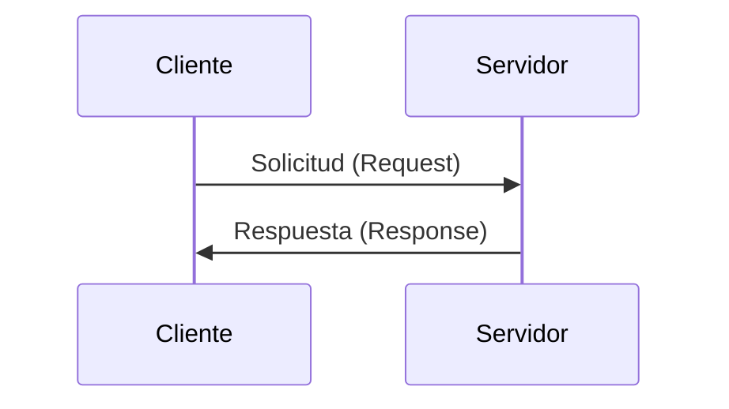
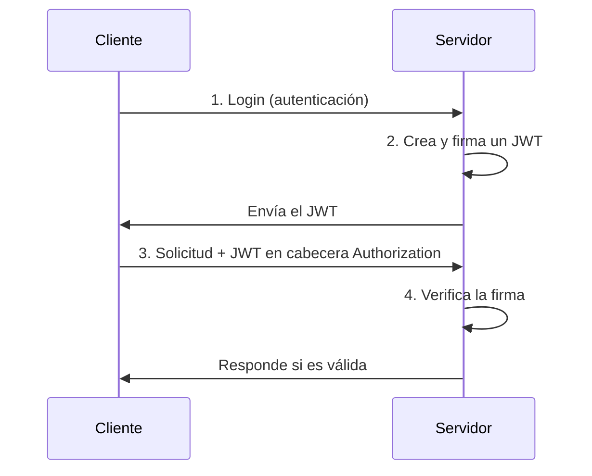

# Redes

## Metadata
- **Fuente original:** `raw/papers/2026-08-03-redes.md`
- **Autor:** [[big-school]]
- **Fecha:** 2026-08-03
- **Tipo de documento:** Documento Técnico (PDF `0_5_2_-_Redes.pdf`, Módulo 0)

## Summary
Segunda fuente del Módulo 4: recorre la comunicación cliente-servidor desde la identidad de red (IP, DNS) y el transporte (TCP vs. UDP, puertos) hasta el protocolo HTTP (métodos, anatomía de petición/respuesta, códigos de estado) y la gestión de estado en un protocolo naturalmente "amnésico" (cookies, sesiones, JWT). Es la base técnica sobre la que se construyen las APIs cubiertas en la fuente siguiente.

## Key Takeaways
1. **Modelo Cliente-Servidor:** el cliente envía una Solicitud (Request), el servidor procesa y envía una Respuesta (Response).
2. **IP identifica el dispositivo; DNS traduce nombres de dominio legibles a direcciones IP.**
3. **TCP vs. UDP:** TCP garantiza fiabilidad (numera, verifica, reensambla y reenvía paquetes perdidos) — crítico para datos financieros o ejecución de código; UDP sacrifica esa verificación por latencia mínima — ideal para streaming/videoconferencia.
4. **Puertos identifican el servicio específico** dentro de un dispositivo (HTTP: 80, HTTPS: 443); una configuración incorrecta puede exponer vulnerabilidades o dejar servicios inaccesibles.
5. **HTTP es el idioma cliente-servidor:** métodos GET/POST/PUT/PATCH/DELETE mapean a operaciones CRUD; toda petición tiene línea de inicio, cabeceras y cuerpo; toda respuesta tiene código de estado (2xx/3xx/4xx/5xx), cabeceras y cuerpo.
6. **HTTP es stateless ("amnésico"):** Cookies permiten que el servidor "recuerde" al cliente; las Sesiones son la alternativa segura (ID de sesión en vez de datos sensibles en la cookie); los **JWT** son la solución moderna y escalable para microservicios — autónomos, verificables sin consultar una base de datos centralizada.

## Detailed Breakdown

### 1. El Modelo Cliente-Servidor
El Cliente inicia la conversación con una Solicitud; el Servidor escucha, procesa y responde. Es el patrón fundacional de toda comunicación de red moderna.

### 2. La Identidad Digital y el Transporte de Datos
Cada nodo necesita ser localizable: la **Dirección IP** (ej. `192.0.2.1`) identifica cada dispositivo; el **DNS** traduce nombres legibles (`google.com`) a esas direcciones. Sobre esa localización, **IP** mueve los paquetes de un punto a otro sin garantizar llegada; **TCP** se asienta sobre IP y añade fiabilidad — numera, verifica, reensambla y reenvía lo que falte. **UDP** sacrifica esa verificación por velocidad, siendo preferible para streaming donde un salto de señal es mejor que un retraso acumulado.

### 3. Puertos: Los Apartamentos de la Red
La IP localiza el edificio; el puerto identifica el servicio específico dentro de él (HTTP: 80, HTTPS: 443). Una solicitud se dirige a una combinación IP:Puerto (`192.0.2.1:443`). La segmentación de puertos es tanto técnica como estratégica — una mala configuración puede exponer vulnerabilidades.

### 4. El Lenguaje de la Web: HTTP y Métodos
TCP establece la conexión física; **HTTP** define el idioma de la conversación (HTTPS es su versión cifrada). Una URL se compone de protocolo, host, puerto, ruta, parámetros y fragmento. Los métodos HTTP mapean a operaciones CRUD: **GET** (Leer), **POST** (Crear), **PUT/PATCH** (Actualizar — reemplazo total vs. parcial), **DELETE** (Eliminar).

Cada petición tiene tres partes: línea de inicio (método + URL), cabeceras (metadatos, credenciales de autorización) y cuerpo (payload opcional). Los códigos de estado se agrupan en 2xx (éxito), 3xx (redirección), 4xx (error del cliente) y 5xx (error del servidor).

### 5. Gestión del Estado en Entornos Stateless
HTTP no recuerda interacciones pasadas. Las **Cookies** (vía cabecera `Set-Cookie`) permiten que el servidor "reconozca" al cliente, pero almacenar datos sensibles en ellas es inseguro. Las **Sesiones** resuelven esto: login → el servidor crea una sesión con un ID único → envía ese ID al cliente en una cookie → el cliente lo presenta en cada solicitud subsecuente.

### 6. La Modernidad de los JSON Web Tokens (JWT)
En arquitecturas de microservicios, las sesiones tradicionales (almacenadas centralmente) no escalan bien. El **JWT** es un pase digital firmado criptográficamente y autónomo (self-contained) que contiene toda la información necesaria del usuario — permite que servidores distintos verifiquen la identidad sin consultar una base de datos centralizada en cada petición, habilitando aplicaciones globales con millones de usuarios simultáneos.

## Diagrams & Visualizations

### Modelo Cliente-Servidor


### Flujo de autenticación con JWT


## Code & Pseudocode Examples

### Anatomía de una petición HTTP
```text
POST /api/libros HTTP/1.1 <-- Línea de Inicio (Método y Ruta)
Host: biblioteca.com
Content-Type: application/json <-- Cabeceras (Metadatos)
User-Agent: MiNavegador/1.0

{
"titulo": "El Quijote" <-- Cuerpo (Datos, opcional)
}
```

### Anatomía de una respuesta HTTP
```text
HTTP/1.1 201 Created <-- Línea de Estado
Content-Type: application/json <-- Cabeceras
Server: Apache/2.4.41

{ <-- Cuerpo
"id": 1,
"mensaje": "Libro creado exitosamente"
}
```

## Entities Mentioned
- [[big-school]]

## Concepts Discussed
- [[redes-y-protocolos-tcp-ip]]
- [[protocolo-http]]

## Notable Quotes
> "El dominio de la comunicación cliente-servidor permite a los perfiles de gestión y desarrollo desmitificar la complejidad técnica de las APIs, transformando conceptos abstractos en activos operativos que impulsan el ROI."

## Connections & Reflections
- Segunda fuente del nuevo Módulo 4 — no existía ningún concepto de red en el wiki. Se crean [[redes-y-protocolos-tcp-ip]] (IP/TCP/UDP/DNS/puertos/modelo cliente-servidor) y [[protocolo-http]] (métodos, anatomía, códigos de estado, cookies/sesiones/JWT) como dos conceptos separados, ya que la fuente siguiente ([[wiki/sources/2026-08-03-apis-comunicacion]]) construye sobre HTTP para definir REST — mantenerlos separados evita mezclar "transporte" con "diseño de API".
- Conecta con [[fundamentos-de-computacion]]: cada petición de red consume ciclos de CPU y memoria en ambos extremos de la comunicación.

## Open Questions
- ¿Qué diferencias prácticas de seguridad existen entre JWT sin cifrar (solo firmado) y JWE (JSON Web Encryption) para datos sensibles en el payload?

## Related Sources
- [[wiki/sources/2026-08-03-fundamentos-computacion]] — la capa de hardware/SO subyacente a cada comunicación de red.
- [[wiki/sources/2026-08-03-apis-comunicacion]] — REST y APIs construidas sobre HTTP.

---

**Estado:** ✅ Completamente procesado e integrado en el wiki
